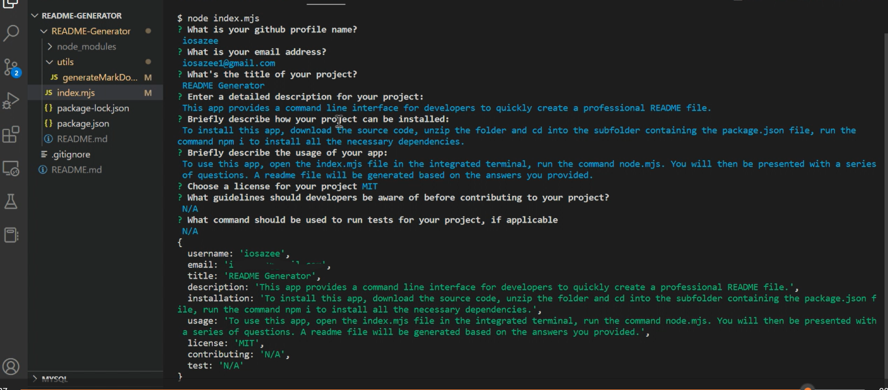

# README Generator


## Description

This app provides a command line interface for developers to quickly create a professional README file. Thereby, saving precious time which can be devoted to other development activities.


## Table of Contents

* [Installation](#installation)

* [Usage](#usage)

* [License](#license)

* [Contributing](#contributing)

* [Tests](#tests)

* [Questions](#questions)

## Installation

```
    To install this app, download the source code, unzip the folder and cd into the subfolder containing the package.json file, run the command npm i to install all the necessary dependencies.
```

## Usage

To use this app, open the index.mjs file in the integrated terminal, run the command node index.mjs. You will then be presented with a series of questions. A README file will be generated based on the answers you provided.

- [click here](https://watch.screencastify.com/v/I9XsuihueGDp9te2T37J) for a video demo of this application.

- 

## License
This project is licensed under the MIT license. Read the fine print of [MIT license](https://opensource.org/licenses/MIT)

### Technologies Used

- Node.JS and NPM.
- Inquirer
- Badge generator [Shields.IO](https://shields.io/category/license)
- Screencastify


## Contributing

N/A

## Tests

```
N/A
```

## Questions

If you have any questions you can contact me at iosazee1@gmail.com.

You can see more of my work at [my github's profile](https://github.com/iosazee).


<font size="1">This README was generated by [README-Generator](https://github.com/iosazee/README-Generator)</font>